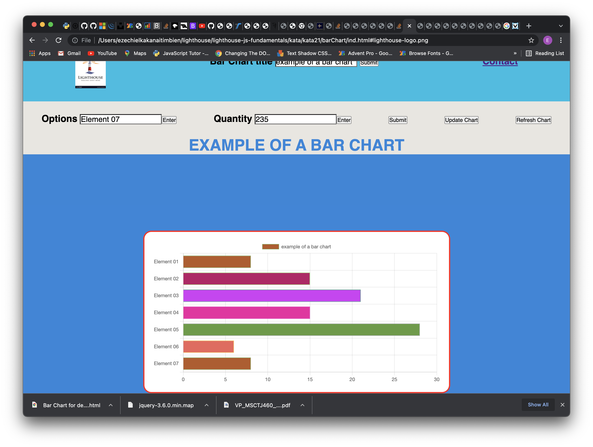

# Bar Chart

## My Bar Chart project in Lighthouse work preparation for the Bootcamp.

This project will consist of building a library that will allow other developers to generate bar charts on their web pages using HTML, CSS and JavaScript. I also be using jQuery to access and manipulate the DOM in order to draw the charts.

### This is how it will show in browser.
---



* [1] Enter the Char title and submit
* [2] Enter the labels or option of any char
* [3] Enter the amount for each option
* [4] Submit the char

> The Char Bar will appear with all elements

## The different buttons 

* The Enter buttons are for the input below it
* The Submit button is for to submit the char and to see the result
* The Update is for to update the char. The char still the same but it add the element you add
* The Refresh button is for to make a new char.

## The _function_ we used 

> For the color the input when it is active


```javascript
  $(document).ready(function(){
    $('input').focus(function(){
        $(this).css('background', 'yellow');
      });
    $('input').blur(function(){
        $(this).css('background', 'white');
      });
  });
```

> For the Char title
```javascript
function myFunction1() {
        newTitle = document.getElementById("charTitle").value;
           document.getElementById("titleDisplay").innerHTML = newTitle;
           return newTitle
}
```
> For accepted the labels and amount

```javascript
function myFunction2() {
    let newOption = document.getElementById("option").value;
        key1 = newOption
        newOptions.push(key1);
        return key1
}

function myFunction3() {
  let newQt = document.getElementById("quantity").value;
      totQt = +totQt + +newQt;
      value = +newQt;
      newValue.push(value);
}
```

> For to Update the char 
```javascript
function updateChart(){
   $('#chartNew').empty();
   $('#chartNew').html('<canvas id="myChart"></canvas>');
}
```

> For to refresh the char and create a new char

```javascript
function refreshChart(){
  $('#chartNew').empty();
  $('#titleDisplay').empty();
  $('#chartNew').html('<canvas id="myChart"></canvas>');
  newTitle = '';
  newOptions = [];
  newValue = [];
  totQt = 0;
}
```
> For random color
```javascript
function getRandomColorHex() {
  let hex = "0123456789ABCDEF",
        color = "#";
  for (let i = 1; i <= 6; i++) {
      color += hex[Math.floor(Math.random() * 16)];
    }
    return color;
}
  ```
## Image or Logo 

<p>I have only the Lighthouse Logo in the top of screen, on header</p>

## A Feature list of my library

### It use JQuery.js and Chart.js

<p>This is the different link for the library I used in this project</p>

1. [JQuery Ajax 4.7.0](https://cdnjs.cloudflare.com/ajax/libs/font-awesome/4.7.0/css/font-awesome.css)

1. [JQuery Ajax 3.4.1](https://cdnjs.cloudflare.com/ajax/libs/jquery/3.4.1/jquery.min.js)

2. [JQuery Code 3.5.0](https://code.jquery.com/jquery-3.5.0.js)

4. [Chart.js](https://cdn.jsdelivr.net/npm/chart.js)

> For the footer I used this links 

1. [Tweeter Logo](http://www.twitter.com)
2. [Facebook logo](http://www.facebook.ca)
3. [Instagram](http://www.instagram.com)

### The tutorials and documents

* [Jquery Document](https://api.jquery.com/)
* [Mozila.com](https://developer.mozilla.org/fr/docs/Web/API/Document_Object_Model/Traversing_an_HTML_table_with_JavaScript_and_DOM_Interfaces)

* [Chartjs.org](http://www.chartjs.org "Youtube Chanel")

* [Traversy Media](https://www.youtube.com/c/TraversyMedia/about "Youtube chanel")


#### Some issue I have to fixed

* I'm working to know how ot clean the input zone after I have the data.
* I still looking what JQuery method can help me to draw a chart.
* The Eslint install still a problem

